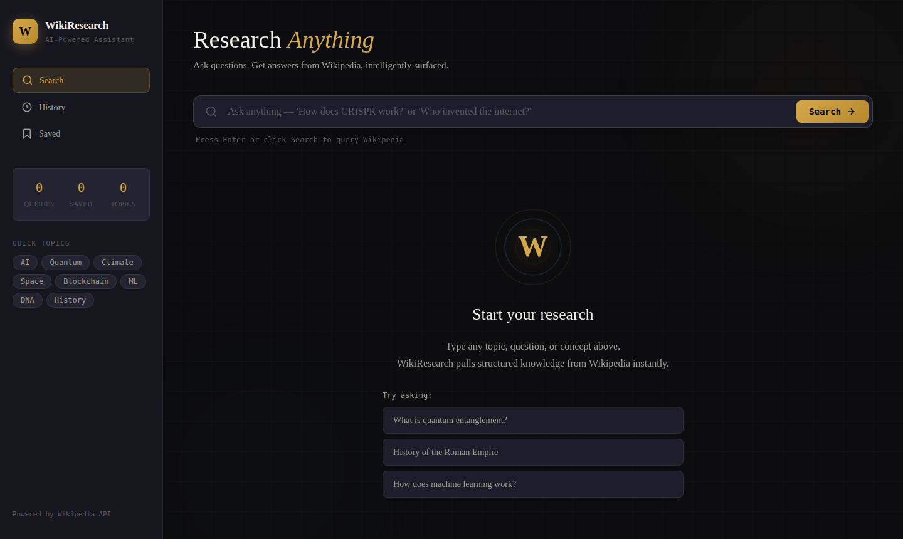
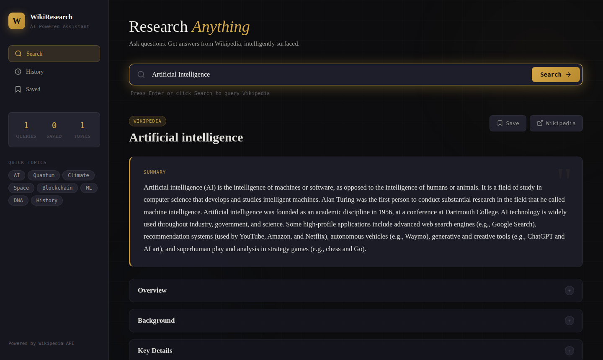
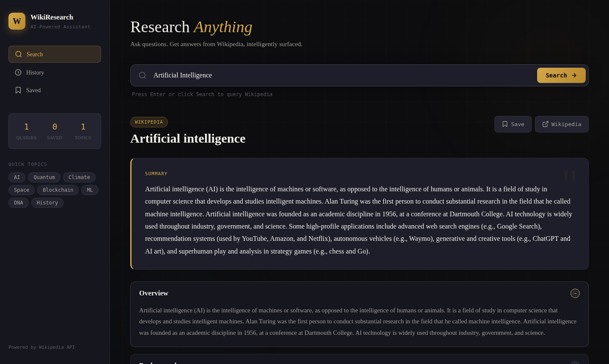
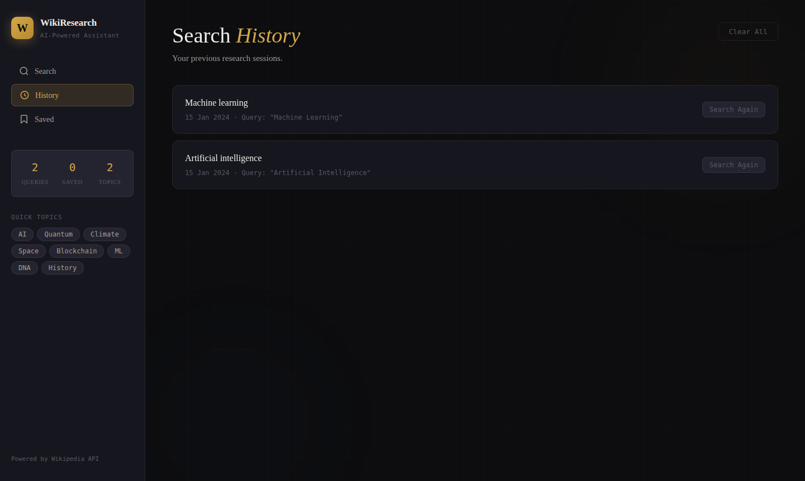
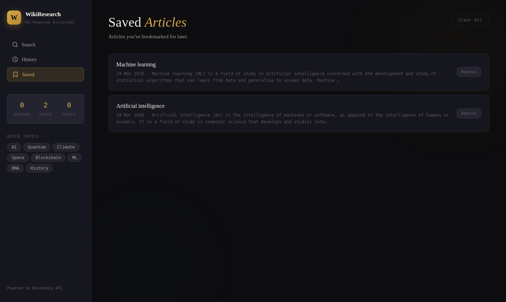
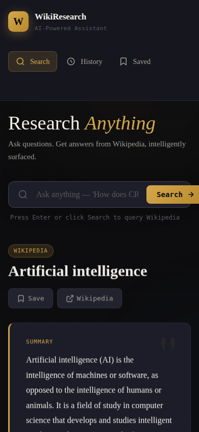

<div align="center">


<br/><br/>

**An intelligent, zero-dependency research assistant powered by the Wikipedia API.**

Ask any question in natural language and get structured, readable answers pulled live from Wikipedia — no backend, no API key, no build step.


[Overview](#overview) · [Features](#features) · [Screenshots](#screenshots) · [Quick Start](#quick-start) · [Architecture](#architecture) · [Testing](#testing) · [Documentation](#documentation)

</div>

---

## Overview

**WikiResearch** is a pure front-end web application that turns Wikipedia into a personal research assistant. Type a question like *"How does CRISPR work?"* and the app searches Wikipedia, fetches the best-matching article, and presents it as a clean summary with collapsible sections, related topics, PDF export, and persistent history — all rendered in an elegant dark editorial interface.

The project is deliberately framework-free. It demonstrates:

- **Real-time API orchestration** — search → summary → related links, chained with `async/await` and `Promise.all`
- **Resilient data fetching** — automatic retries across candidate articles and a dual-API fallback (REST v1 → MediaWiki Extracts)
- **Clean layered architecture** — Data Service, Storage Service, and UI Controller separated without any framework
- **Production-quality UI** — responsive dark theme, CSS animations, accessible states for loading, error, and empty views
- **Automated testing** — 5 Vitest suites covering the API layer, storage, UI logic, security, and integration flows

## Features

### Research
| Feature | Description |
|---------|-------------|
| Natural language search | Ask full questions, not just keywords |
| Live Wikipedia data | Every query fetches fresh content from Wikipedia's REST API |
| Smart content parsing | Long extracts are split into labelled, collapsible sections (Overview, Background, Key Details) |
| Related topics | Surfaces up to 10 linked articles for deeper exploration |
| PDF export | Download any result as a print-ready report |
| Direct source link | One-click access to the full article on Wikipedia |

### Organization
| Feature | Description |
|---------|-------------|
| Saved articles | Bookmark results to a persistent reading list |
| Search history | Every search stored locally (up to 30 entries) with one-click re-run |
| Live session stats | Sidebar counters for queries, saved articles, and unique topics |
| Quick topics | One-click chips for popular subjects (AI, Quantum, Climate, …) |

### Reliability & UX
| Feature | Description |
|---------|-------------|
| Automatic retry | If the top result fails, the next two candidates are tried silently |
| Dual API fallback | REST v1 summaries fall back to the MediaWiki Extracts API — a result is always returned |
| Specific error messages | Distinct handling for no results, network failure, and `file://` CORS issues |
| Fully responsive | Adapts from 1440px desktop down to 375px mobile |
| Keyboard support | Press Enter to search |

## Screenshots

| Welcome | Results |
|---|---|
|  |  |

| Collapsible Sections | Search History |
|---|---|
|  |  |

| Saved Articles | Mobile (390px) |
|---|---|
|  |  |

## Quick Start

No dependencies or build step are required to run the app — only a local HTTP server.

```bash
git clone https://github.com/VijayKumaro7/WikiResearch-ResearchAnything-.git
cd WikiResearch-ResearchAnything-

# Option 1 — Python
python -m http.server 3000
# then open http://localhost:3000

# Option 2 — Node.js
npx serve .

# Option 3 — VS Code
# Right-click index.html → "Open with Live Server"
```

> **Note:** Opening `index.html` directly via double-click uses the `file://` protocol, which blocks Wikipedia's API due to CORS. Always serve over HTTP.

## Architecture

```
┌──────────────────────────────────────────────────────────────────┐
│                      BROWSER (client-side only)                  │
│                                                                  │
│  ┌──────────────────┐  ┌──────────────────┐  ┌──────────────┐    │
│  │ WikipediaService │  │  StorageService  │  │ UIController │    │
│  │   (data layer)   │  │  (persistence)   │  │ (view layer) │    │
│  │                  │  │                  │  │              │    │
│  │  search()        │  │  getHistory()    │  │ showState()  │    │
│  │  getSummary()    │  │  addToHistory()  │  │ render*()    │    │
│  │  getRelated()    │  │  saveArticle()   │  │ updateStats()│    │
│  │  research() ─────┼──┼──────────────────┼──▶              │    │
│  └────────┬─────────┘  └──────────────────┘  └──────────────┘    │
│           │                                                      │
└───────────┼──────────────────────────────────────────────────────┘
            │  HTTPS + CORS (origin=*)
            ▼
┌──────────────────────────────────────────────────────────────────┐
│  Wikipedia REST API v1              MediaWiki Action API         │
│  /api/rest_v1/page/summary          /w/api.php?action=query      │
│  (primary summaries)                (search · related · fallback)│
└──────────────────────────────────────────────────────────────────┘
```

**Lifecycle of a search** — `"How does machine learning work?"`:

1. `handleSearch()` fires and the loading state is shown
2. `WikipediaService.research()` finds the top 5 candidate articles, fetches the best summary (retrying up to 3 candidates), and loads related links in parallel
3. `StorageService.addToHistory()` persists the result to `localStorage`
4. `UIController.renderResult()` renders the summary card, accordion sections, and related-topic chips
5. Sidebar statistics update automatically

## Project Structure

```
WikiResearch-ResearchAnything-/
├── index.html              # Application shell and UI structure
├── styles.css              # Complete stylesheet — design tokens, layout, animations
├── app.js                  # Browser bundle: Services + UI Controller + entry points
│
├── src/                    # ES modules (mirrors app.js, used by the test suite)
│   ├── wikipedia.js        # WikipediaService — search, summary, related, research
│   ├── storage.js          # StorageService — history and saved-article persistence
│   └── ui-logic.js         # Pure UI helpers — section chunking, stats, formatting
│
├── tests/                  # Vitest suites
│   ├── wikipedia.test.js   # API layer: fetching, retries, fallbacks
│   ├── storage.test.js     # Persistence: history caps, dedupe, save/remove
│   ├── ui-logic.test.js    # Section splitting and stat computation
│   ├── security.test.js    # XSS and HTML-injection hardening
│   └── integration.test.js # End-to-end search flows
│
├── Docs/                   # Screenshots and logo assets
├── ARCHITECTURE.md         # System diagram, data flow, localStorage schema
├── API_REFERENCE.md        # Method-level documentation for every service
├── SETUP.md                # Local server options, deployment, troubleshooting
└── test_plan.md            # 40+ manual test cases and a console smoke test
```

## Tech Stack

| Layer | Technology | Rationale |
|-------|-----------|-----------|
| Structure | HTML5 | Semantic and accessible, no transpiling |
| Styling | CSS3 (custom properties, Grid, Flexbox) | Full design control, zero preprocessors |
| Logic | Vanilla JavaScript (ES2020) | Demonstrates pure JS architecture skills |
| Data | Wikipedia REST API v1 + MediaWiki API | Free, public, CORS-enabled, no auth |
| Persistence | `localStorage` | Zero-dependency client-side storage |
| Testing | Vitest + jsdom | Fast unit and integration tests for the ES modules |
| Build | None | Serve the folder and it runs |

## Testing

The runtime app has zero dependencies; dev dependencies are used only for the test suite.

```bash
npm install
npm test              # run all suites once
npm run test:watch    # watch mode
npm run test:coverage # coverage report
```

## Error Handling

| Scenario | Behavior |
|----------|----------|
| No Wikipedia matches | "No articles found" message with a retry prompt |
| Network down / DNS failure | Explains the problem and warns about `file://` usage |
| Article redirect or 404 | Silent retry with the next search candidate |
| All candidates fail | Falls back to the search snippet — results are never blank |
| Related-links failure | Caught silently; the section is simply omitted |

## Documentation

- [ARCHITECTURE.md](ARCHITECTURE.md) — full system diagram, module responsibilities, and data-flow walkthrough
- [API_REFERENCE.md](API_REFERENCE.md) — JSDoc-style reference for every public method
- [SETUP.md](SETUP.md) — local development, deployment (GitHub Pages / Netlify / Vercel), and troubleshooting
- [test_plan.md](test_plan.md) — manual test cases across search, navigation, responsiveness, and edge cases

## Roadmap

- [ ] Multi-language Wikipedia support (ES, HI, FR, …)
- [ ] Light/dark theme toggle
- [ ] Voice search via the Web Speech API
- [ ] AI-powered summarization of extracts
- [ ] Offline reading with a Service Worker

## License

Released under the [MIT License](https://opensource.org/licenses/MIT) — free to use, modify, and distribute.

## Author

**Vijay Kumar** — Data Analyst & Full-Stack Developer

[](https://github.com/VijayKumaro7)
[](https://www.linkedin.com/in/vijay-kumar070/)
[](https://vijayportfolio07.netlify.app/)

---

<div align="center">
<em>WikiResearch — Research anything. Understand everything.</em>
</div>
